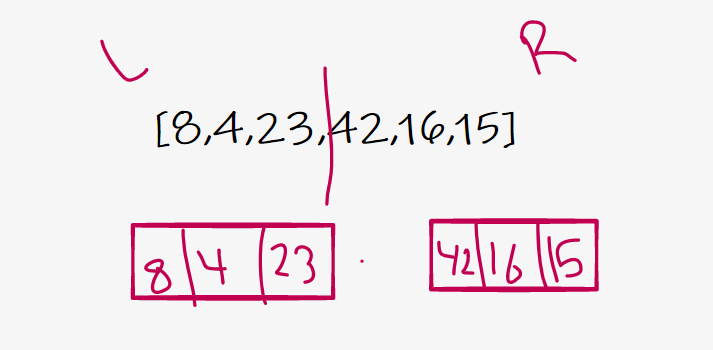
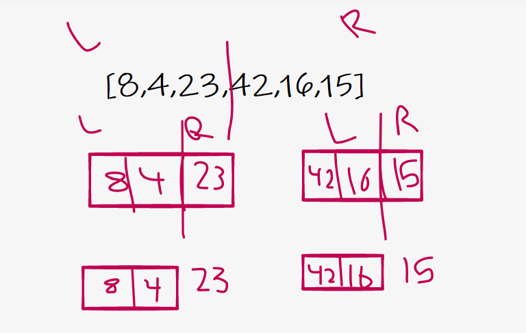
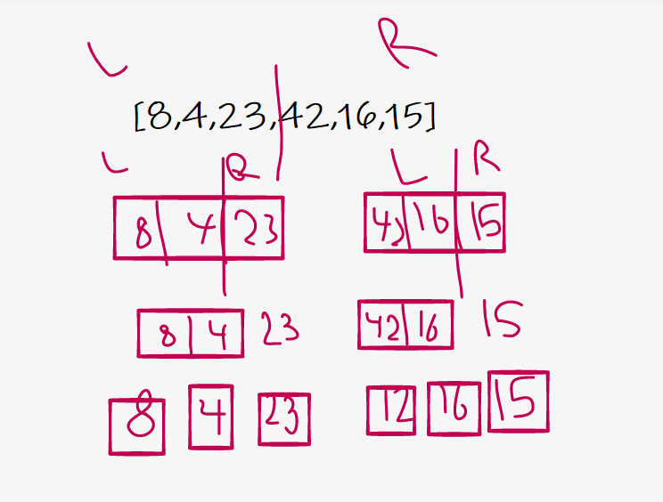
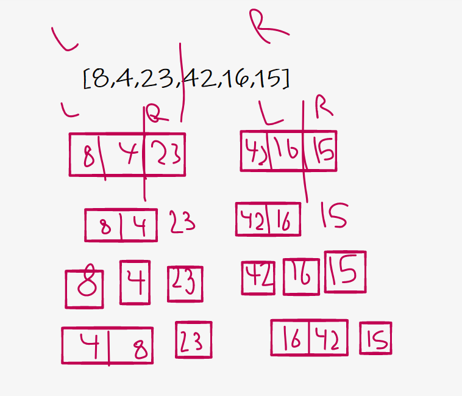
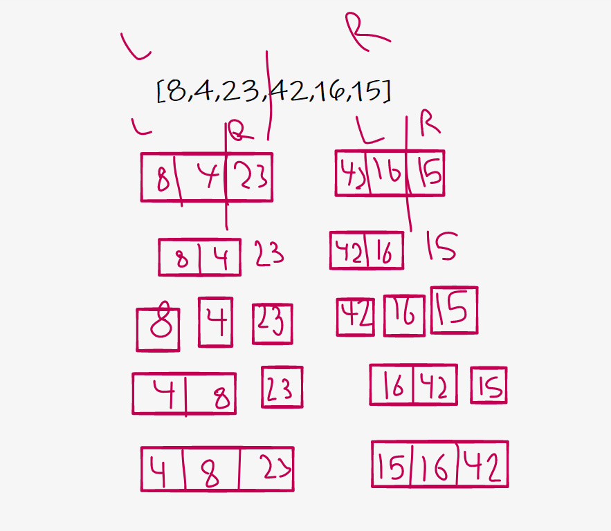
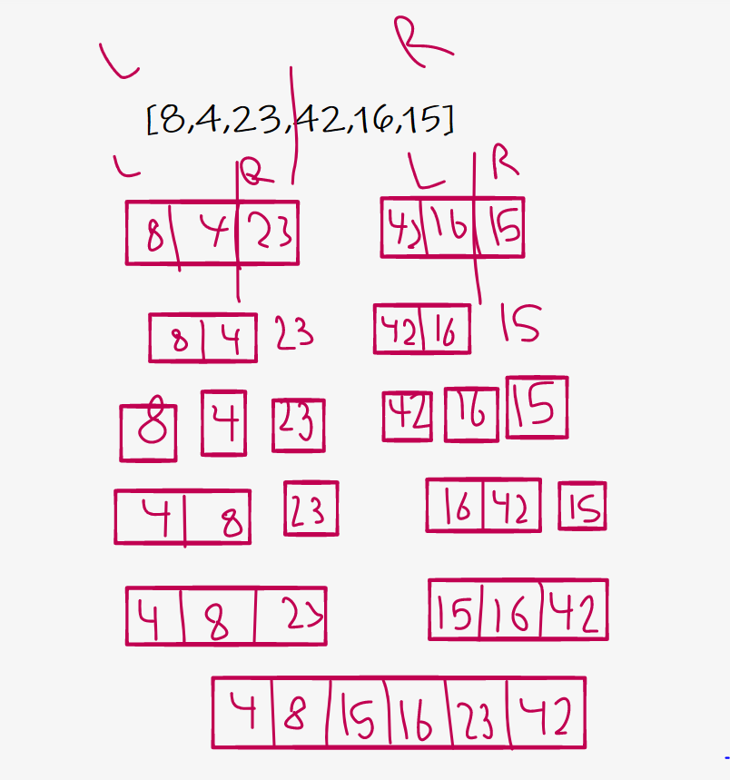

## code challenge 27
### Merge Sort is a Divide and Conquer algorithm. It divides the input array into two halves, calls itself for the two halves, and then merges the two sorted halves. The merge() function is used for merging two halves. The merge(arr, l, m, r) is a key process that assumes that arr[l..m] and arr[m+1..r] are sorted and merges the two sorted sub-arrays into one. See the following C implementation for details.
### Pseudocode:
ALGORITHM Mergesort(arr)
DECLARE n <-- arr.length

    if n > 1
      DECLARE mid <-- n/2
      DECLARE left <-- arr[0...mid]
      DECLARE right <-- arr[mid...n]
      // sort the left side
      Mergesort(left)
      // sort the right side
      Mergesort(right)
      // merge the sorted left and right sides together
      Merge(left, right, arr)

ALGORITHM Merge(left, right, arr)
DECLARE i <-- 0
DECLARE j <-- 0
DECLARE k <-- 0

    while i < left.length && j < right.length
        if left[i] <= right[j]
            arr[k] <-- left[i]
            i <-- i + 1
        else
            arr[k] <-- right[j]
            j <-- j + 1

        k <-- k + 1

    if i = left.length
       set remaining entries in arr to remaining values in right
    else
       set remaining entries in arr to remaining values in left

In this step, we should calculate the mid-point (array length /2) of the array is divided into two parts, right and left, and separated As a result, we have two arrays

The same step as before, the array is divided after calculating the middle of the array

Here the remaining left part is divided So that we have all the value of the array separate so that we can arrange them

After separating all the values The array is merge from the left side by order from smallest to largest

Like the previous step, the left side is merge to the right side according to the order of the numbers from smallest to largest

And here is the last step, as the left and right sides have been returned, arranged according to numbers In the last step, we will merge left and right sides , resulting in an array arranged according to numbers, from smallest to largest
Efficiency:
Time: O( n Log(n) )
Space: O(1)