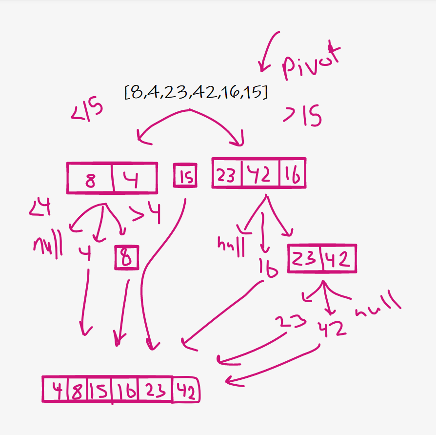

## code challenge 28

### Like Merge Sort, QuickSort is a Divide and Conquer algorithm. It picks an element as pivot and partitions the given array around the picked pivot. There are many different versions of quickSort that pick pivot in different ways.
### psuedocode

ALGORITHM QuickSort(arr, left, right)
if left < right
// Partition the array by setting the position of the pivot value
DEFINE position <-- Partition(arr, left, right)
// Sort the left
QuickSort(arr, left, position - 1)
// Sort the right
QuickSort(arr, position + 1, right)

ALGORITHM Partition(arr, left, right)
// set a pivot value as a point of reference
DEFINE pivot <-- arr[right]
// create a variable to track the largest index of numbers lower than the defined pivot
DEFINE low <-- left - 1
for i <- left to right do
if arr[i] <= pivot
low++
Swap(arr, i, low)

     // place the value of the pivot location in the middle.
     // all numbers smaller than the pivot are on the left, larger on the right.
     Swap(arr, right, low + 1)
    // return the pivot index point
     return low + 1

ALGORITHM Swap(arr, i, low)
DEFINE temp;
temp <-- arr[i]
arr[i] <-- arr[low]
arr[low] <-- temp

step 1 : take on element and make it as a pivot element

step 2 : divid the array into half and sort it for two groups less then pivot and highse then pivot

step 3 : do the same thing for the divided arrays

step 4 :repeat it until i have a sorted array