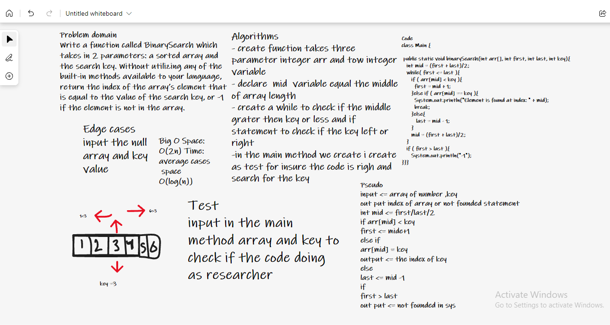

# Array binary search
Write a function called BinarySearch which takes in 2 parameters(sorted array, key). and return the index of the array’s element that is equal to the value of the key, or -1 if the element is not in the array.

# Approach & Efficiency

I used IntelliJ to test the code.
Started by understanding the concept behind the binary search, by creating a method that has a while and more than if statemnt
defined the middle index of the array and wrote the conditions based on it.
Big O Space: O(1) Time: O(log(n))