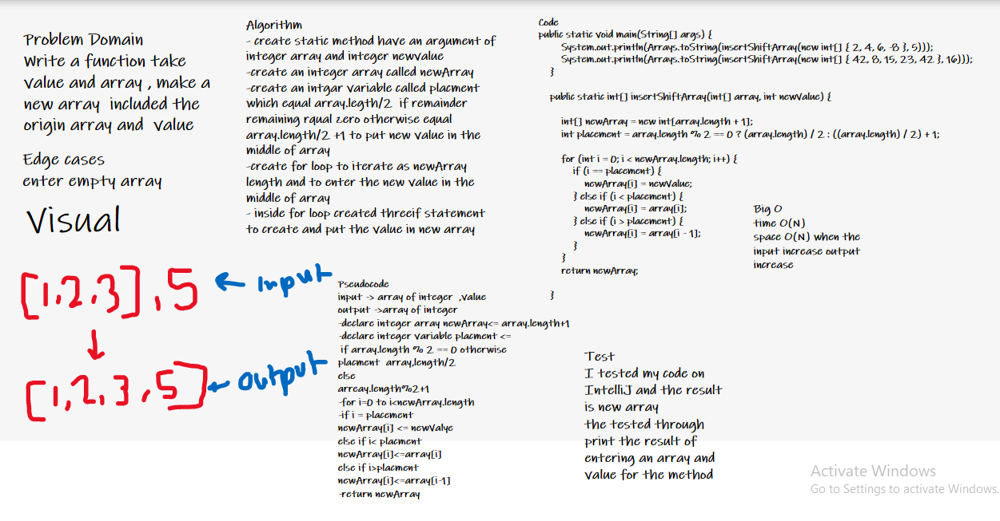

# array-insert-shift

Write a function called insertShiftArray which takes in an array and a value to be added and return an array with the new value added at the middle index.

Approach & Efficiency

Depending on the size of the matrix, odd or even -> int midArray = array.length % 2 == 0 ? (array.length) / 2 : ((array.length) / 2) + 1;
 useing for loopinside of it  add 3 conditions to add the new value in the middle of array with new array and return new array