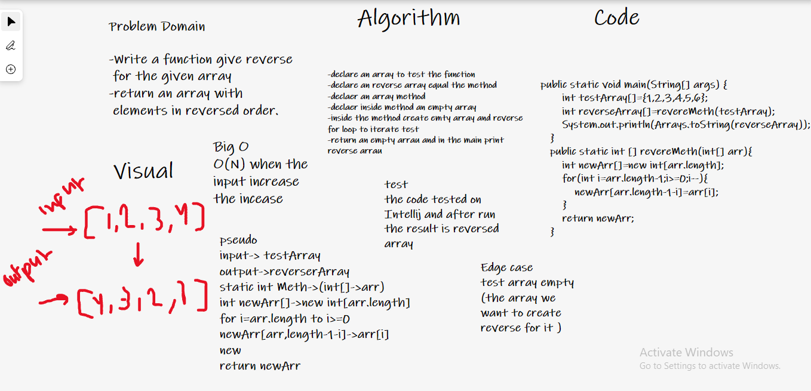

# Reverse an Array

#### Write a function called reverseArray:which takes an array as an argument. Without utilizing any of the built-in methods available to your languagereturn an array with elements in reversed order.

Approach & Efficiency
useing for loop to reverse the array , for( i < arr.length ) .after that i add variable to hold reversed array In the next step is store the value reversed