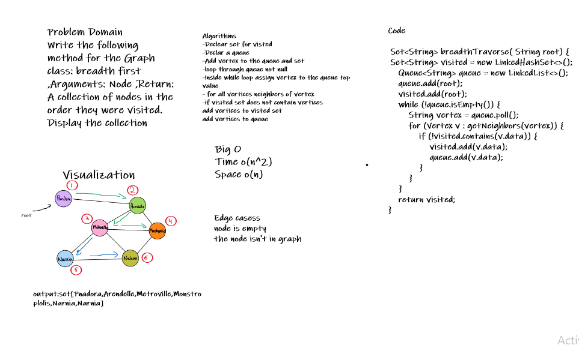

# Graphs

A Graph is a non-linear data structure consisting of nodes and edges. The nodes are sometimes also referred to as vertices and the edges are lines or arcs that connect any two nodes in the graph.

## Code challenge 35

Implement your own Graph. The graph should be represented as an adjacency list, and should include the following methods:

- add vertex

- add edge

- get vertices

- get neighbors

- size

## Approach and Efficiency

1) add vertex

- Time: O(1)
- Space: O(1)

2) add edge
- Time: O(1)
- Space: O(1)

3) get Vertices

- Time: O(1)
- Space: O(n) ---> n: is the number of Vertices

3) get neighbors

- Time: O(1)
- Space: O(n) ---> n: is the number of neighbor Vertices

5) size

- Time: O(n) n: is the number of neighbor Vertices
- Space: O(1)

## Graph Breadth First
Create a static method which returns a Set of the Graph vertices in their breadth from a specified root.

## code Challenge 36

Create a method that take a vertex as a parameter as a start point and return a collection of vertices in the order they were visited.

## Whiteboard Process

## Approach and Efficiency
Time: O(n^2)

Space: O(n)

