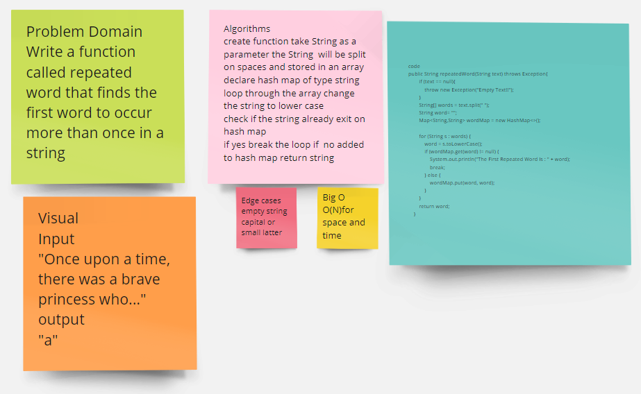

# Hash Table Implementation
A hash table is a data structure and it is an array of list. Each list is known as a bucket. The position of the bucket is identified by calling the hashcode() method

# Challenge
Implement a Hashtable Class

# API
```add(String key, T value)```: add the key and value pair to the table.

```get(int key)```: Returns value associated with that key in the table

```contains```: Returns boolean, indicating if the key exists in the table already.


# Hashmap-repeated-word CC31
Write a function that accepted a string parameter which finds the first word to occur more than once in a string and return a string.

## Whiteboard Process


