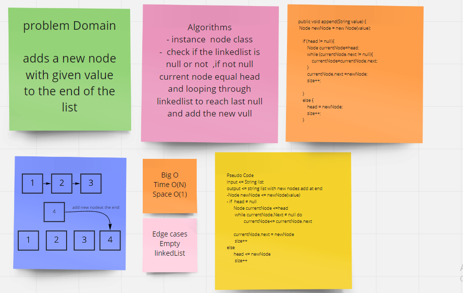
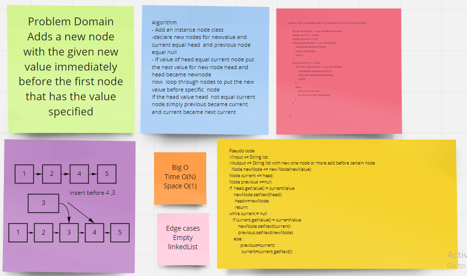
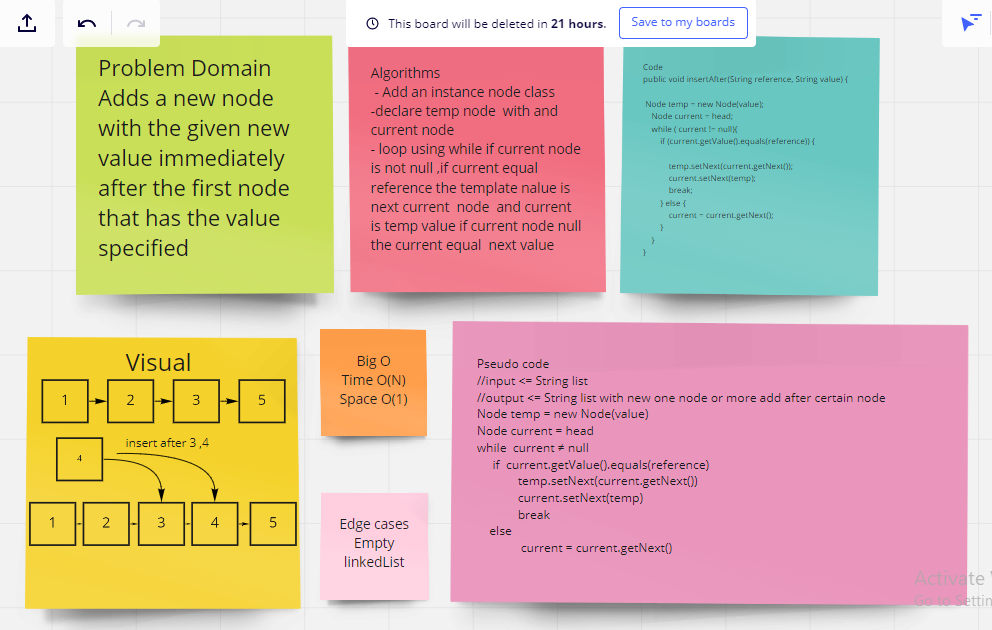
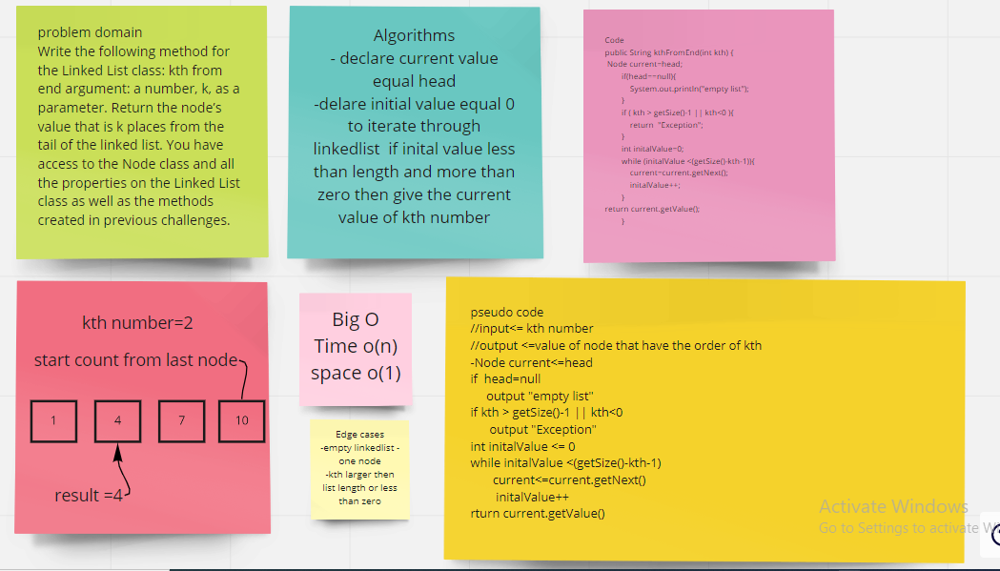
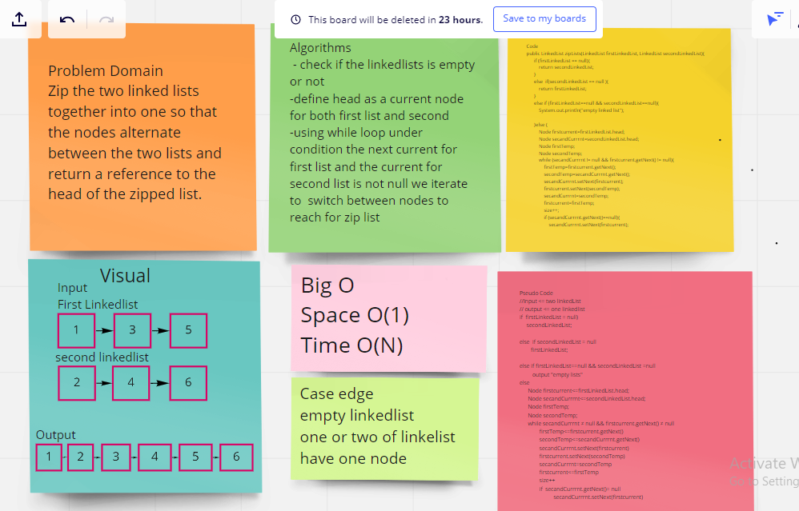

# Challenge 05
# Linked List
Nodes that are connected to each other which mean Node references the next Node.

 # Challenge Summary

- A Node class that has properties for the value stored in the Node,
and a pointer to the next Node.
- Insert method to add a new node at the beginning of the LinkedList.
- Includes method to ensure that liked list have specific nods value Indicates 
- create  toString  methods takes  no arguments and returns a string representing all the values in the Linked List

# Approach & Efficiency 

- Insert
define new node if head is null the new node equal head otherwise the next of new node equal the head of likedlist and the new node id head
-Includes
loop throw the linked list then ensure if the node is exist through build in methods Objects.equals

-toString: Returns a string containing all the values of the nodes of the linked list.

# Code challenge 06 

# Challenge Summary
In this challang I created three methods one
for adding new node at the end of list , before referance node and after referance 
node (referance node is the node we want to add node before or after  ) 

## Whiteboard Process

## Approach & Efficiency
while loop to iterate over the linked list nodes the complexity: time :O(N) Space :O(1)

# Code Challenge 07 

# Challenge Summary
write a method give the value of order node from tail in liked list 
## Whiteboard Process

# Code challenge 08

# Challenge Summary

 writing code connect tow linkedlist to one linkedlist that have  nodes alternate between the two lists.

## Whiteboard Process

## Approach & Efficiency
I used a while loop and declared some variables and used get and set methods.

