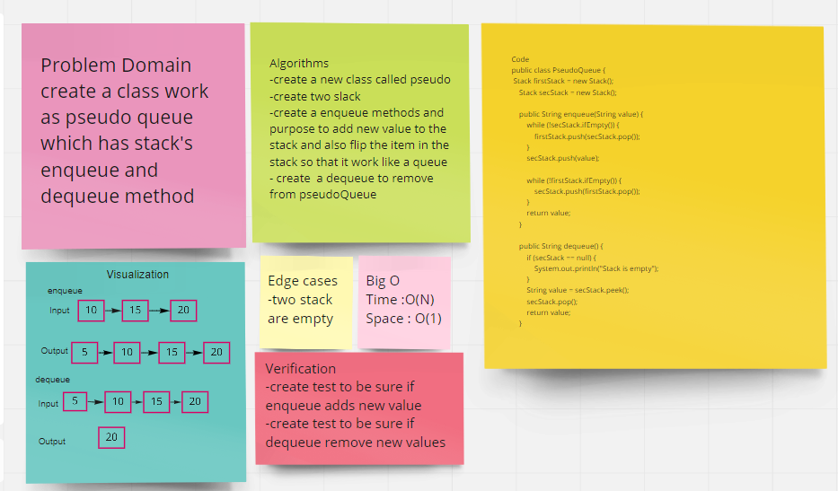
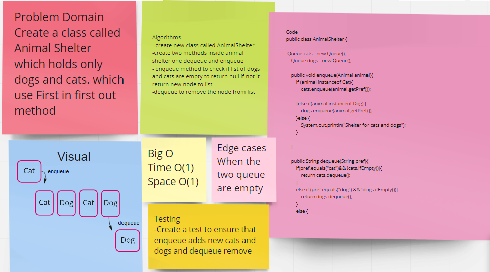

# Stacks and Queues
## Challenge 10
 A stack
Is a data structure that consists of Nodes. Each Node references the next Node in the stack, but does not reference its previous.

A Queue
The Queue is used to insert elements at the end of the queue and removes from the beginning of the queue. It follows FIFO concept

## Approach & Efficiency
Create classes for the Node ,Stack,Queue .
using the methodology of the stacks and queues in creating corresponding methods and basically getnext and setnext methods.
Space: O(1)
Time: O(1)
## API
Stack's Methods

push() to add new node in the stack.

pop() to Remove the node from the top of the stack.

peek() to Returns Value of the node located at the top of the stack.

isEmpty() Boolean indicating whether or not the stack is empty.

Queue's Methods

enqueue(int value) to add new node in the queue.

dequeue() to Removes the node from the front of the queue.

peek() to Returns Value of the node located at the front of the queue.

isEmpty() Boolean indicating whether or not the queue is empty.

## Challenge 11
Implement a queue by using two stacks Create 2Methods: enqueue : Inserts value into the PseudoQueue, using a first-in, first-out approach. dequeue : Extracts a value from the PseudoQueue, using a first-in, first-out approach.

### Whiteboard Process

### Approach & Efficiency

Enqueue Space: O(1)

Time: O(1)

Dequeue Space: O(1)

Time: O(n) API Stacks push() adds an item to the top of the stack.

pop() removes the top element from the stack and returns it.

peek() returns the top element of the stack.

isEmpty() Returns Boolean indicating whether stack is empty.

Queue Enqueue add an item to a queue (to the last)

Dequeue remove an item from a queue(remove the oldest).

Peek returns the front Node of the queue.

isEmpty() Boolean indicating whether or not the queue is empty.

## Challenge 12
Create method that accept animals from two type and shelter (separate) them to two list one for cats and one for dogs by using first in first out principle

Stacks and Queues Stack contains objects that are pushed and popped according to the last-in first-out (LIFO) principle. Queue contains objects that are enqueued and dequeued according to the first-in first-out (FIFO) principle.

### Whiteboard Process

### Approach & Efficiency
Space O(1) Time O(1)
