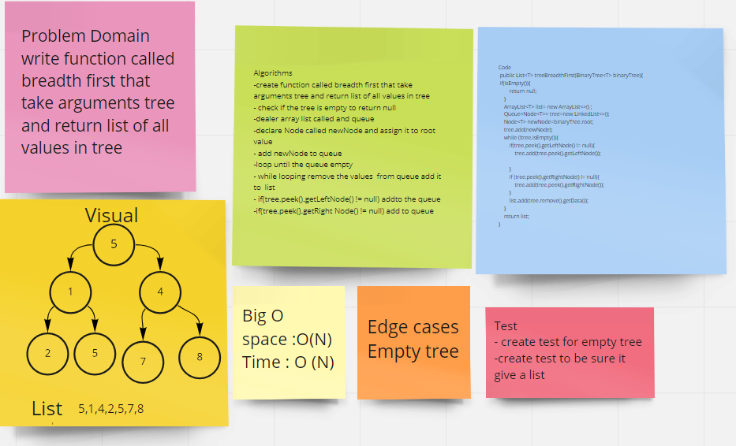
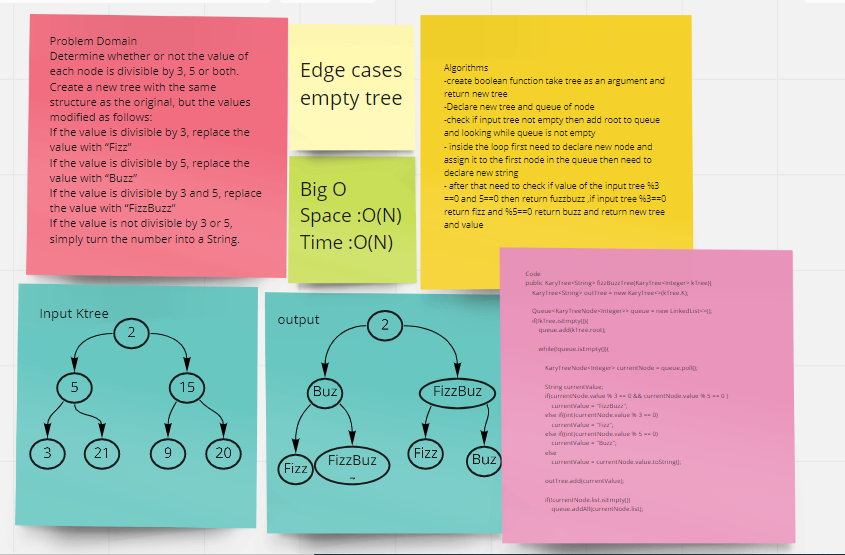

# Trees

# Code challenge 15
This challenge was to traverse a binary search tree and create include and contains methods.

###  Implementations :
Nodes
Binary Trees
Binary Search Trees

### Approach & Efficiency
The approach is simple we compare the node data and add nodes to the tree based on if the data is larger (to the right node) or smaller(to the left node) than the data of the current node
- Time complexity O(log(n))
- Space O(1)

# Code challenge 16

Implemented a max method that returns an integer, Saved the traversed data into a list and loop through the list and find the maximum value and return it.

## Whiteboard Process

## Approach & Efficiency

Space O(n) Time O(n)

## Solution
Make an object of the Binary Tree and add elements to it.
Call the max method to find the maximum value in the tree.

# Challenge Summary
Write a method that accepts a tree as an argument and return list of all values in the tree, in the order they were encountered.
## Whiteboard Process

## Approach & Efficiency
I used an arraylist and queue, while and if statements.
Space :O(N)
Time:O(N)

# Challenge 18
Write a function called fizz buzz tree takes k-ary tree as an argument and return new k-ary tree. Determine whether or not the value of each node is divisible by 3, 5 or both.
## Whiteboard Process

## Approach & Efficiency
- Space O(N)
- Time O(N)
